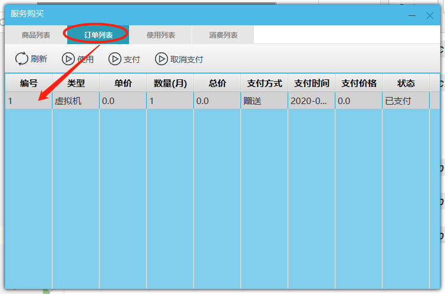
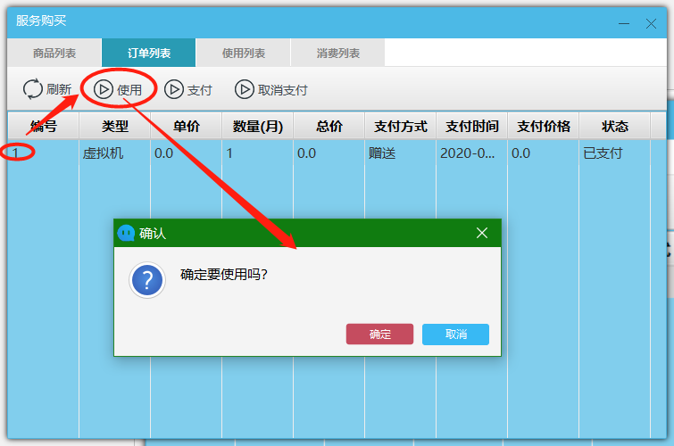
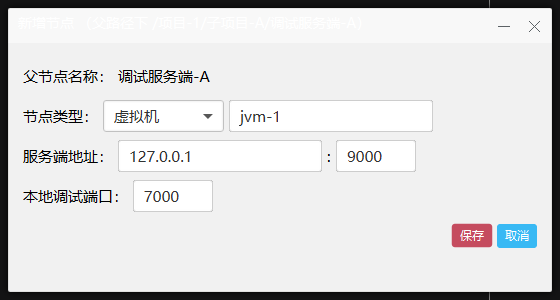

#1 调试服务端 
##1.1 下载
 * 百度下载地址
    * 链接：https://pan.baidu.com/s/1NjCKi4wPZPaEK8z7fT6LOg
    * 提取码：myue
##1.2 安装
 * windows
    * 打开对应的setup.exe文件，下一步到底
    * 例如：mingyue-debug-server-win-x86_64-setup.exe
 * linux
    * 解压对应的setup.zip文件到指定目录 
    * 例如：unzip -o -d mingyue-debug-server mingyue-debug-server-linux-x86_64-setup.zip
##1.3 启动
 * windows
    * 打开桌面快捷键 
    * 例如：mingyue-debug-server-x86_64
    * 例图：
 * linux
    * 执行解压目录下的run.sh 
    * 例如：
        * cd mingyue-debug-server/
        * sh run.sh
##1.4 停止
 * windows
    * 鼠标右键单击任务栏带D字母的图标，选择退出
    * 例图：
 * linux
    * 执行解压目录下的stop.sh 
    * 例如：
        * cd mingyue-debug-server/
        * sh stop.sh
##1.5 是否更新
  * windows
     * 双击任务栏带D字母的图标，会弹出关于对话框，提示是否需要更新版本
     * 例图：
     * 例图：
  * linux
     * 启动时查看日志
     * 例如：
         * cd mingyue-debug-server/logs
         * tail -f output.####-##-##.log
         * > 07-28  13:59:06.169 [Thread-12] INFO  today.mingyue.d.c  - 明月调试服务 版本:1.001 最新版本:1.002
  * 明月客户端-【mingyue-pc】
    * 客户端 启动 调试服务端时 也会提示 是否需要更新 操作
    * 例图：
#2 客户端
##2.1 下载
  * 百度下载地址 
     * 链接：https://pan.baidu.com/s/1HdRvXKYjE4zHfoDAlYOREw 
     * 提取码：myue
##2.2 安装
  * windows；
    * 打开对应的setup.exe文件，下一步到底
    * 例如：mingyue-pc-win-x86_64-setup.exe
##2.3 启动
  * windows
    * 打开桌面快捷键 
    * 例如：mingyue-pc-win-x86_64
    * 例图：
##2.7 登录
 * windows
     * 登录界面
     * 例图：
     * 支付宝二维码登录 ， 点击图片的中的支付宝二维码，出现有支付宝扫描
        * 设置密码，扫码登录成功后会立即提示修改密码 
        * 例图：
        * 登录账号查看，在扫码登录后立即生成登录账号
        * 例图：
     * 微信二维码登录（暂不支持）
     * 账号登录 
     * 例图：
##2.4 停止
  * windows
    * 鼠标右键单击任务栏的蓝色图标，选择退出
    * 例图：
##2.5 更新 
  * windows
     * 客户端启动后，会检查版本号，如果有新版本，就会弹出更新对话框，只要弹出更新对话框就是必须要更新的
     * 例图：

     
##2.8 配置调试节点
 * windows
    * 打开主面板
    * 例图：
    * 打开自己的聊天窗口
    * 例图：
    * 点击调试小虫子图标
    * 例图：
    
##2.8.1 购买
 * windows
    * 点击购买图标
    * 例图：
    * 查看购买列表 ，有购买的、有赠送的，第一次可以选择赠送
    * 例图：
    * 查看订单列表
    * 例图：
    * 点击使用订单
    * 例图：
    * 查看用订单列表
    * 例图：
    * 图中标题显示是虚拟机的使用天数 ，可以再重新选择购买调试服务器，最终如下图
    * 例图：
    * 之后就可以增加调试节点了
    
##2.8.2 管理节点
 * windows
    * 在管理节点之前需要先购买 虚拟机和调试服务端时长，在调试面板空白处单击鼠标右键，弹出管理菜单
    * 例图：
    * 管理菜单分类
    * 例图：
##2.8.2.1 编辑分组节点
 * windows
    * 空白处，单击右键，选择菜单的【新增】
    * 节点类型选择分组，输入名称，点击确定，多增加几个分组
    * 例图：
    * 例图：
    * 选择菜单的【编辑】【删除】，进行相应的操作
##2.8.2.2 编辑调试服务端节点
 * windows
    * 选中一个分组，单击右键，选择菜单的【新增】
    * 节点类型选择【服务端】，输入名称
    * 例图：
        * 服务端地址：安装 【mignyue-debug-server】的服务IP地址
            * 外网IP地址：【mingyue-pc】可以在外网链接调试，速度受外网链接影响会比较慢
            * 内网IP地址：【mingyue-pc】只可以在内网链接调试，速度比较快
        * TCP端口：【mingyue-pc】外网或内网链接【mignyue-debug-server】使用，速度比较慢
        * UDP端口：【mingyue-pc】外网或内网链接【mignyue-debug-server】使用，速度快
        * 服务I D：【mignyue-debug-server】启动时产生的ID
            * 例图：
        * 验证按钮，点击可以检查 服务ID 是否正确   
    * 填写完毕    
    * 例图：
    * 点击确定返回
    * 例图：
    * 选择菜单的【编辑】【删除】，进行相应的操作
##2.8.2.3 编辑JVM节点
 * windows
    * 选中一个分组，单击右键，选择菜单的【新增】
        * 节点类型选择【虚拟机】，输入名称
        * 例图：
            * 服务端地址：需要调试JVM的服务IP地址
                * 外网IP地址：建议不需要
                * 内网IP地址：一版是内网地址
            * TCP端口：JVM打开远程调试的端口
                * -Xdebug -Xrunjdwp:server=y,transport=dt_socket,address=9000,suspend=n
                * 例图：
            * 本地调试端口：本地IDE链接【】进行调试的端口
                * 例图：
        * 填写完毕    
        * 例图：
        * 点击确定返回
        * 例图：
        * 选择菜单的【编辑】【删除】，进行相应的操作
##2.8.2.4 编辑IDE节点
 * windows
    * 暂时无法操作
##2.8.3 删除IDE节点
 * windows
    * 暂时无法操作
##2.8.4 管理角色
 * windows
    * 空白处，单击右键，选择菜单的【角色管理】
    * 在弹出的角色管理对话框中，单击新增
    * 例图：
        * 超级管理员权限
            * 分配权限
            * 修改节点
            * 删除节点
        * 普通管理员权限
            * 启动服务端
            * 停止服务端
            * 启动链接虚拟机
            * 停止链接虚拟机
        * 开发测试环境权限
            * 只读调试
                * 例如：不可以修改变量，一版在生产和测试环境 选择这一项
            * 可写调试 
                * 例如：可以修改变量，一版在开发环境 选择这一项
            * 短时间调试
                * 断点停留超过30秒后，自动向虚拟机发送往下执行的命令，一版在生产和测试环境 选择这一项
            * 长时间调试
                * 断点停留永久，一版在开发环境 选择这一项
            * 临时阻止他人调试
                * 可以阻止其他人调试本JVM机器，一版给组长这个权限
    * 超级管理员           
    * 例图：
    * 普通管理员
    * 例图：
    * 开发人员-测试、线上环境
    * 例图：
    * 开发人员-开发环境
    * 例图：
##2.8.4.1 编辑角色
 * windows
    * 选择一个角色，右边可以进行编辑
    * 例图：
##2.8.4.2 删除角色
 * windows
    * * 选择一个角色，再点击删除按钮
    * 例图：
##2.8.5 管理用户
 * windows
    * 选择一个分组、服务端或者虚拟机，单击右键，选择菜单的【用户管理】 ，分配用户
    * 例图：
    * 用户是必须是自己的好友，把用户增加到自己的好友中
    * 例图：
    * 选择用户
    * 例图：
    * 分配权限
    * 例图：
    * 完成结果
    * 例图：
##2.8.5.1 编辑用户
 * windows
    * 选择一个用户，点击角色名称，可以切换角色
    * 例图：
##2.8.5.2 删除用户
 * windows
    * 选择一个用户，点击删除按钮
    * 例图：
#3 调试
##3.1 启动被调试的JVM
 * windows
    * 启动 被调试的JVM ，远程调试端口是：9000
        * 参数是：-Xdebug -Xrunjdwp:server=y,transport=dt_socket,address=9000,suspend=
        * 例图：
        * 样例代码如下：
        ```
          public class AppTest {
              public static void main(String[] args) {
                  new Thread(new Runnable() {
                      @Override
                      public void run() {
                          int i = 0;
                          while (true) {
                              try {
                                  Thread.sleep(300);
                              } catch (InterruptedException e) {
                                  e.printStackTrace();
                              }
                              System.err.println(i++);
                              System.err.println(i++);
                              System.err.println(i++);
                              System.err.println(i++);
                              System.err.println(i++);
                              System.err.println(i++);
                              System.err.println(i++);
                              System.err.println(i++);
                              System.err.println(i++);
                              System.err.println(i++);
                          }
                      }
                  }).start();
              }
          }
        ```
    * 例图：
##3.2 启动【mingyue-debug-server】
 * windows
    * 例图：
##3.2 启动【mignyuue-pc】
 * windows
    * 打开自己的聊天窗口
    * 例图：
    * 选择服务端，点击启动
    * 例图：
    * 状态  
    * 例图：
        * 远程 
            服务端 - 【mingyue-debug-server】 的状态
            虚拟机 - 【被调试JVM】的状态
        * 本地
            服务端 - 【mingyue-pc】是否连接到【mingyue-debug-server】的状态
            虚拟机 - 【mingyue-pc】连接【被调试JVM】的状态，端口表示调试【被调试JVM】的代理端口
##3.3 调试
 * windows
    * 打开IDE工具例如IDEA，设置代理调试端口
    * 例图：
    * 启动调试 ，设置断点
    * 例图：
    * 查看聊天窗口
    * 例图：
    
##3.4 临时阻止用户调试
 * windows
    * 好友1登录【mingyue-pc】，打开好友2的聊天窗口
    * 例图：
    * 点击【调试】按钮
    * 例图：
    * 选择【调试服务】，点击启动按钮
    * 例图：
    * 打开IDE，链接端口，进行远程调试
    * 返回2的聊天窗口，刷新调试列表，在【jvm】下面找到1的ide调试节点，单击右键选择【临时阻止】
    * 例图：
    * 阻止结果
    * 例图：
    * 在阻止时间内，即使打了断点也不会，进入调试调试状态
    * 例图：
    * 等待临时阻止时间过期后就可以再次调试
##3.5 短时间、长时间调试
 * windows
    * 短时间调试 ，IDE在收到调试事件后，如果不进行下一步调试，等待30秒后，jvm自动往下执行，但是IDE不会被通知
    * 长时间调试 ，IDE在收到调试事件后，如果不进行下一步调试，jvm一直等待下去
##3.6 只读、可写调试
 * windows
    * 只读调试，调试过程中不可以修改变量
    * 可写调试，调试过程中可以修改变量
 