#1 明月调试
* 该软件是为Java开发人员提供的JVM远程调试代理工具
    * 基于JVM本身的远程调试功能
    * 避免对JVM侵入式设置agent
    * 只需开启JVM远程调试端口
    * 重新封装调试命令 
    * 屏蔽危险调试命令 
    * 长时间调试防呆
    * 支持内网、外网调试
    * 有效避免JVM调试端口暴漏到外网
    * 临时阻止他人调试某一个JVM
    * 增加多用户管理、多JVM分组管理
* 该软件由客户端和服务端两部分组成
* 该软件采用saas的部署方式（同时支持私有云的部署方式）
    * 联系电话和微信号：13681736659
    * 微信群：
* 该软件采用低收费模式，不会给开发人员和技术公司带来经济负担

#2 Java调试遇到的问题
* 项目一般只在本地调试，部署后很难再被调试
* 项目分布式部署后，即使可以远程调试，也很难找到对应的JVM
* 遇到线上问题只能通过看log日志，如果没有加log日志则更麻烦
* 生产环境安全第一的原则，更是无法进行直接调试 

#3 该软件解决这一切的问题
* 解决分布式环境下对JVM无法调试的问题
* 可以直接对生产环境远程调试，快速定位线上问题
* 通过设置只读权限，阻止用户修改JVM中的变量

#4 原理流程 
* 正向调试流程 【IDE】-->【客户端】-->【服务端】-->【JVM】 
    *  1【IDE】发送调试命令到 【客户端】
    *  2【客户端】把命令转发到【服务端】
    *  3【服务端】最终把命令发送给【JVM】
* 反向通知流程 【IDE】<--【客户端】<--【服务端】<--【JVM】 
    *  1【JVM】发送调试事件到 【服务端】
    *  2【服务端】把事件转发到【客户端】
    *  3【客户端】最终把事件发送给【IDE】
    
#5 使用场景
* 个人网站Java后台、公司大型网站Java后台
* 传统项目架构、微服务架构
* 多环境项目、多业务、多JVM、多开发人员、多角色
* 软件使用架构
   * 例图：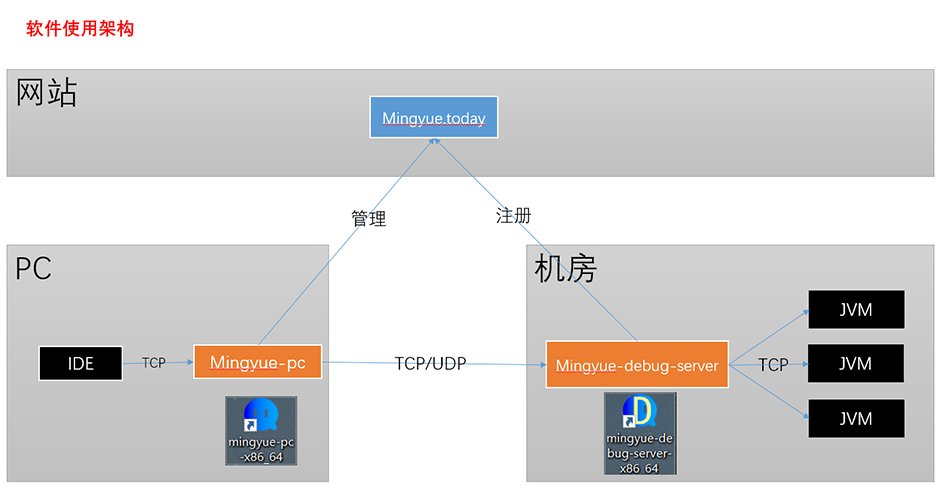
* 节点配置架构
   * 例图：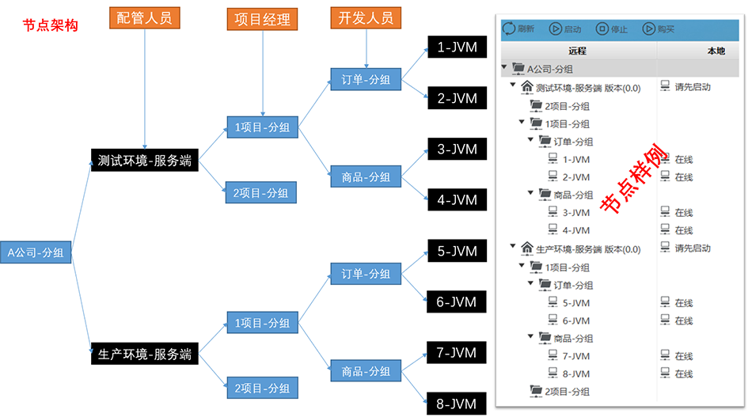

#6 快速使用
##6.1下载、安装
* 服务端 mingyue-debug-server
    * 百度下载地址
    * 链接：https://pan.baidu.com/s/1NjCKi4wPZPaEK8z7fT6LOg
    * 提取码：myue
    * 下载windows 64 位，下一步安装完毕    
* 客户端 mingyue-pc
    * 百度下载地址 
    * 链接：https://pan.baidu.com/s/1HdRvXKYjE4zHfoDAlYOREw 
    * 提取码：myue
    * 下载windows 64 位，下一步安装完毕    
## 6.2 启动被调试【JVM】
* 设置远程调试端口
* 参数是：-Xdebug -Xrunjdwp:server=y,transport=dt_socket,address=9000,suspend=
* 例图：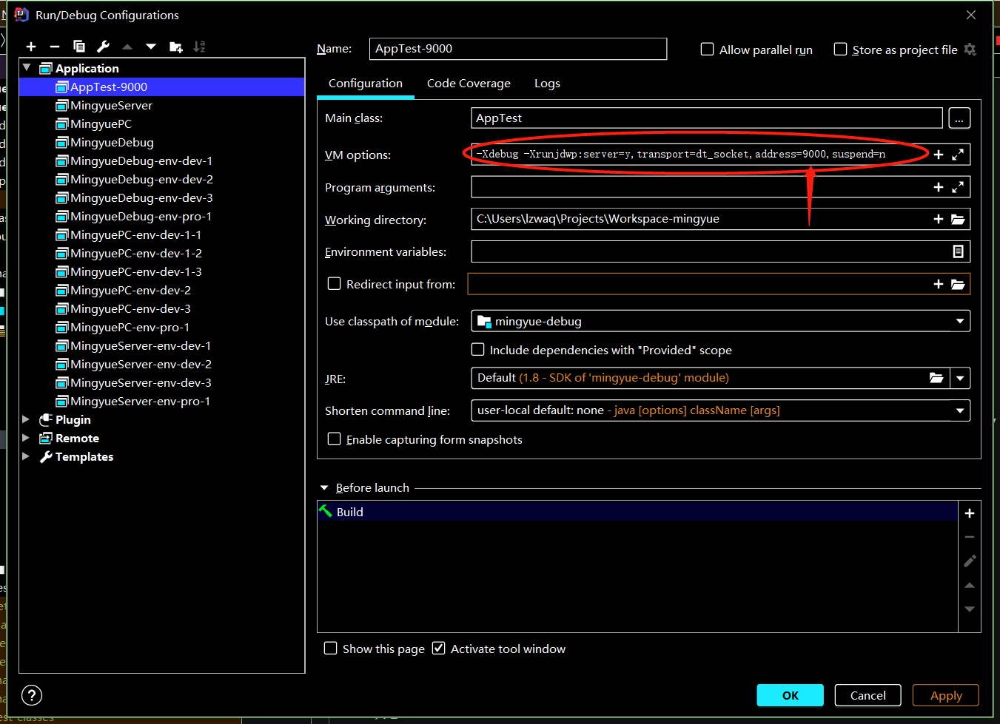
## 6.3 启动【服务端】获取服务id
* 服务ID：【服务端】启动时产生的ID，在终端中复制该服务ID
* 例图：
## 6.4 启动【客户端】配置调试节点
## 6.4.1 登录 ，选择支付宝扫码登录
## 6.4.2 购买JVM和服务端使用期限
* 打开自己的聊天窗口，点击调试小图标，点击购买图标，第一次需要
    * 例图：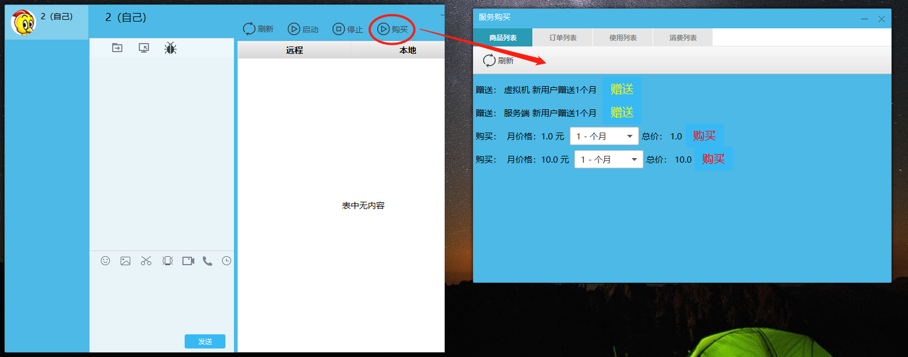
* 查看购买列表 ，有购买的、有赠送的，第一次可以选择赠送
    * 例图：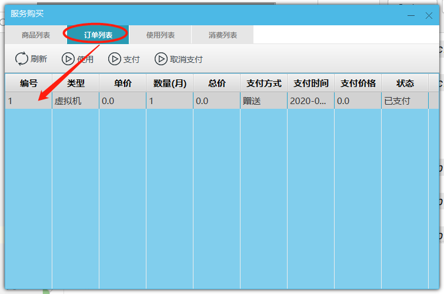
* 选择刚才生成的订单，点击使用
    * 例图：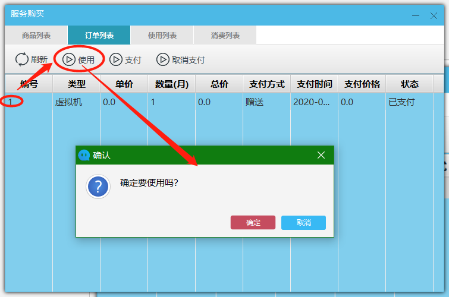
* 查看用订单列表
    * 例图：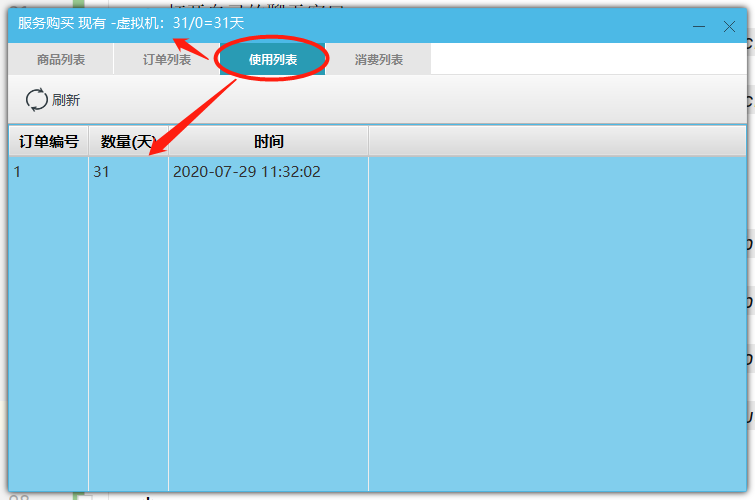
* 图中标题显示是虚拟机的使用天数 ，可以再重新选择购买调试服务器，最终如下图
    * 例图：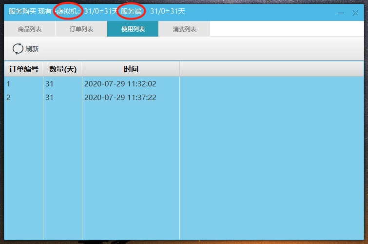
## 6.4.3 增加分组
* 空白处单击右键选择【新增】，节点类型选择分组，输入名称点击确定，多增加几个分组
* 例图：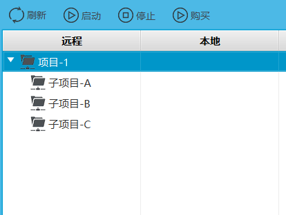
## 6.4.4 增加【服务端】节点
* 选择一个分组，单击右键选择【新增】，节点选择【服务端】，设置ip、端口和服务id
* 例图：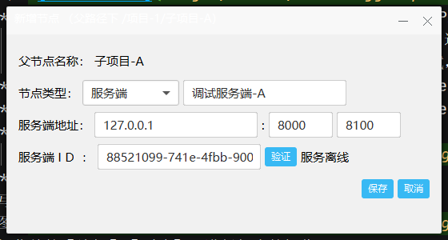    
## 6.4.5 增加【JVM】节点，设置ip、端口
* 选择一个分组，单击右键选择【新增】，节点选择【虚拟机】，设置ip、端口和本地调试端口
* 例图：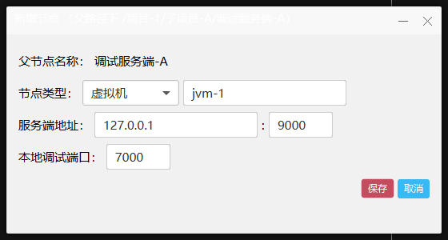
## 6.4.6 启动服务
* 启动远程调试服务 ，选择服务端节点，单击右键选择【启动(远程)】 
* 启动本地调试服务 ，选择服务端节点，单击右键选择【启动(本地)】 
* 例图：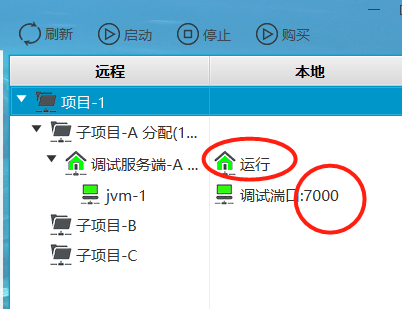
* 复制本地调试JVM的本地端口
## 6.5 在【IDE】设置远程调试端口
* 例图：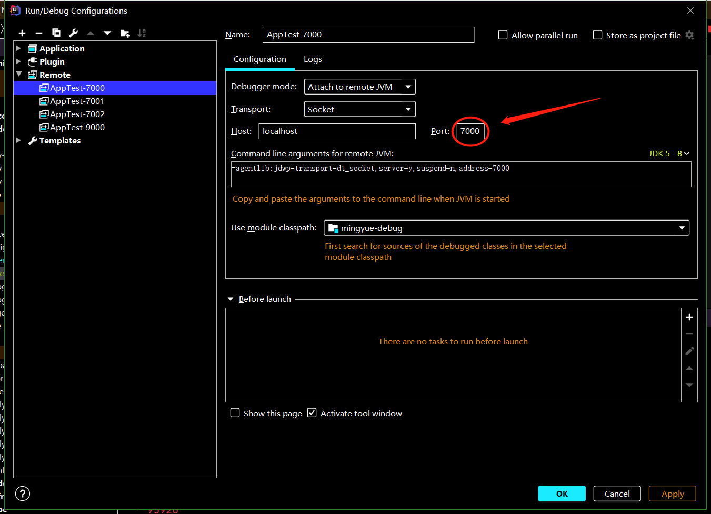
* 在【IDE】中启动调试

    

